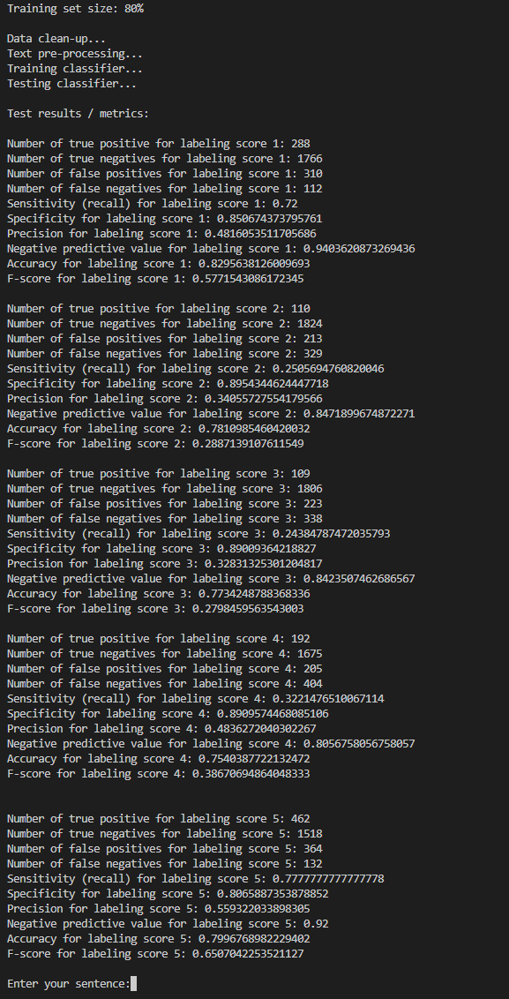
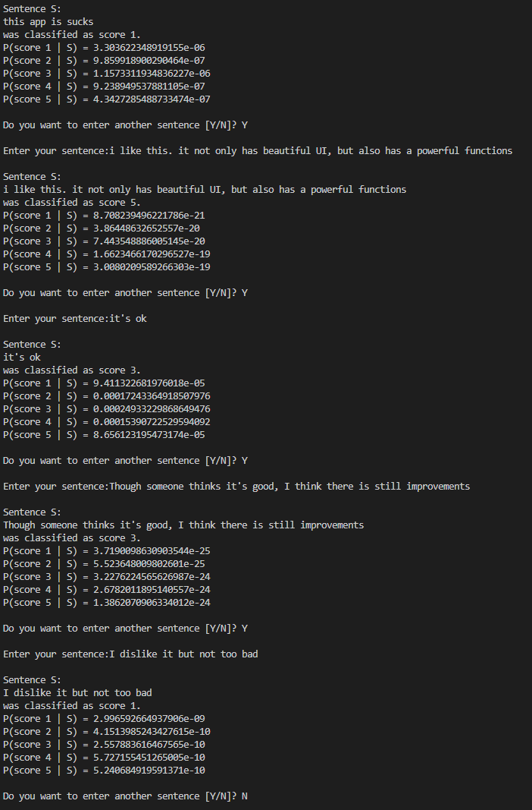

# Project Description
This project is to implement, train, and test a Naïve Bayes classifier without any Python package classifier. It should finally classify sentences entered using the keyboard. The data is [Google Play Store Reviews](https://www.kaggle.com/datasets/prakharrathi25/google-play-store-reviews), which records users' reviews of various Android apps published on Google Play Store. There are 5 labels (1-5 scores) to distinguish comments.

# Processes
### Data Clean-up and Pre-processing
Since the data contains emotions and other non-English languages, the code removes emotions, different languages, punctuation, and stop words first to ensure clear tokens. Some comments may be empty after this step. In the 80% training size, the total number of samples is 12459. The training and testing sets, respectively, are 9967 and 2492.

### Train Classifier
This step is based on the rules of the Naïve Bayes classifier to calculate the probabilities of each category, extract vocabulary from the training data, and compute each word's probability in that class. In calculating the probability of each word, the code also avoids 0 by adding 1 smoothing.

### Test Classifier
Codes test the classifier by using the test set and log-space calculations to avoid underflow and calculates the following metrics:
- number of true positives,
- number of true negatives,
- number of false positives,
- number of false negatives,
- sensitivity (recall),
- specificity,
- precision,
- negative predictive value,
- accuracy,
- F-score

### New Input
Finally, the program will ask the user for keyboard input (sentences S). It will display the classifier decision (1-5 score) with log-space calculations and probabilities of each class, that is P(score 1 | S), P(score 2 | S), P(score 3 | S), P(score 4 | S), and P(score 5 | S). After distinguishing, you are allowed to enter new sentences by typing 'Y' when the code's asking. Type 'N' will exit the program.

# Results
__Test result:__<br>


__Result of new inputs:__<br>


# How to Use
You only need to implement this command on your terminal to run the file:
```
python naive_bayes.py 80
```
`80` is the size of training size which meaning 80% of the all data. You can change the number but the training size must be greater than 20 and less than 80. If you leave it blank or a wrong digital, the code will apply 80% for training.
